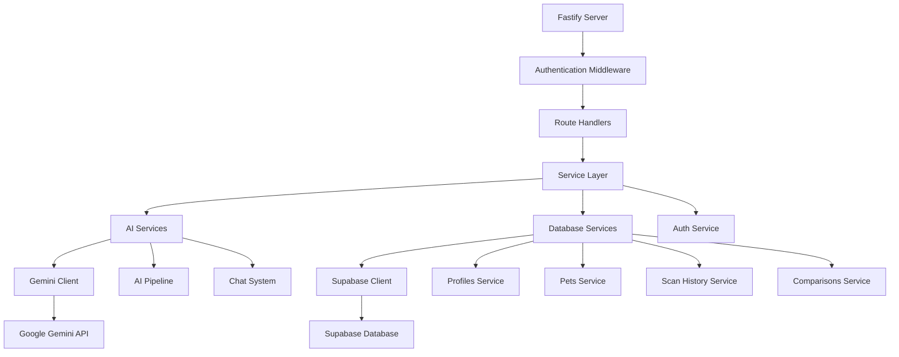

# FeedMagix Backend Setup Design

## Overview

This design outlines the creation of a new Fastify + TypeScript backend for the FeedMagix application, maintaining the same AI pipeline architecture, database schema, and API structure as the previous implementation. The backend will provide AI-powered pet food analysis using Google Gemini AI and Supabase database integration.

## Technology Stack & Dependencies

### Core Framework
- **Fastify**: High-performance Node.js web framework
- **TypeScript**: Type-safe development
- **Node.js**: Runtime environment (ES Modules)

### AI & External Services
- **Google Gemini AI**: `@google/generative-ai` v1.16.0
- **Model**: `gemini-2.5-flash` for vision and text analysis

### Database & Authentication
- **Supabase**: Database, authentication, and real-time features
- **@supabase/supabase-js**: Official Supabase client

### Development & Build Tools
- **tsx**: TypeScript execution for development
- **@types/node**: Node.js type definitions
- **dotenv**: Environment variable management

## Architecture

### Project Structure
```
backend/
├── src/
│   ├── config/
│   │   ├── env.ts
│   │   └── supabase.ts
│   ├── services/
│   │   ├── ai/
│   │   │   ├── gemini.ts
│   │   │   ├── ai-pipeline.ts
│   │   │   └── chat.ts
│   │   ├── database/
│   │   │   ├── base.ts
│   │   │   ├── profiles.ts
│   │   │   ├── pets.ts
│   │   │   ├── food-products.ts
│   │   │   ├── scan-history.ts
│   │   │   ├── chat.ts
│   │   │   ├── comparisons.ts
│   │   │   └── index.ts
│   │   └── auth.ts
│   ├── routes/
│   │   ├── auth.ts
│   │   ├── pets.ts
│   │   ├── scan.ts
│   │   ├── chat.ts
│   │   ├── comparison.ts
│   │   └── analytics.ts
│   ├── types/
│   │   ├── database.types.ts
│   │   ├── ai.types.ts
│   │   └── api.types.ts
│   ├── middleware/
│   │   ├── auth.ts
│   │   ├── cors.ts
│   │   └── error.ts
│   ├── utils/
│   │   ├── validation.ts
│   │   └── helpers.ts
│   └── app.ts
├── package.json
├── tsconfig.json
├── .env
└── README.md
```

### Backend Service Architecture



## AI Pipeline Implementation

### 5-Stage AI Agent Pipeline

The backend will implement the exact same AI pipeline architecture:

#### Stage 1: Image Processing Endpoint
```typescript
POST /api/scan/upload
- Input: Base64 encoded image
- Validation: Image format and size
- Output: Processed image data
```

#### Stage 2: Product Identification Agent
```typescript
POST /api/scan/identify
- Service: identifyProduct()
- Model: gemini-2.5-flash with vision
- Schema: { brand, product_name, size, food_type, species }
```

#### Stage 3: Product Data Retrieval Agent
```typescript
POST /api/scan/retrieve-data
- Service: retrieveProductData()
- Tools: Google Search integration
- Output: Complete product information
```

#### Stage 4: Nutrition Analysis Agent
```typescript
POST /api/scan/analyze
- Service: analyzeNutrition()
- Context: Pet profile integration
- Output: Compatibility score and recommendations
```

#### Stage 5: MLP Output & Delight Layer
```typescript
POST /api/scan/delight
- Service: createDelightOutput()
- Features: Mascot mood, dynamic badges
- Language: Persian with emojis
```

### AI Comparison System
```typescript
POST /api/comparison/analyze
- Service: getComparisonRecommendation()
- Input: Array of products + pet profile
- Output: Ranked recommendations
```

### AI Chat System
```typescript
POST /api/chat/sessions
GET /api/chat/sessions/:id/messages
POST /api/chat/sessions/:id/messages
- Persistent chat sessions
- Pet profile context integration
- Persian language responses
```

## Database Integration

### Supabase Configuration
```typescript
// config/supabase.ts
import { createClient } from '@supabase/supabase-js'

const supabaseUrl = process.env.SUPABASE_URL!
const supabaseServiceKey = process.env.SUPABASE_SERVICE_ROLE_KEY!

export const supabase = createClient(supabaseUrl, supabaseServiceKey)
```

### Database Schema (Maintained from Original)

#### Core Tables Structure
- **profiles**: User profile management
- **pets**: Pet information and health profiles  
- **food_products**: Pet food product catalog
- **scan_history**: AI scan results and analysis
- **chat_sessions**: AI chat conversation management
- **chat_messages**: Individual chat messages
- **food_comparisons**: Multi-product comparison results

### Database Service Layer Pattern
```typescript
// services/database/base.ts
export abstract class BaseService {
  protected supabase = supabase
  protected abstract tableName: string
  
  async findById(id: string) { /* implementation */ }
  async create(data: any) { /* implementation */ }
  async update(id: string, data: any) { /* implementation */ }
  async delete(id: string) { /* implementation */ }
}

// services/database/pets.ts
export class PetService extends BaseService {
  protected tableName = 'pets'
  
  async findByUserId(userId: string) { /* implementation */ }
  async createPet(petData: CreatePetData) { /* implementation */ }
}
```

## API Endpoints Reference

### Authentication Endpoints
```typescript
POST /api/auth/register
POST /api/auth/login
POST /api/auth/logout
GET /api/auth/profile
PUT /api/auth/profile
```

### Pet Management Endpoints
```typescript
GET /api/pets
POST /api/pets
GET /api/pets/:id
PUT /api/pets/:id
DELETE /api/pets/:id
```

### Scan & Analysis Endpoints
```typescript
POST /api/scan/upload
POST /api/scan/identify
POST /api/scan/retrieve-data
POST /api/scan/analyze
POST /api/scan/complete
GET /api/scan/history
GET /api/scan/history/:id
```

### Chat System Endpoints
```typescript
GET /api/chat/sessions
POST /api/chat/sessions
GET /api/chat/sessions/:id
GET /api/chat/sessions/:id/messages
POST /api/chat/sessions/:id/messages
DELETE /api/chat/sessions/:id
```

### Comparison Endpoints
```typescript
POST /api/comparison/create
GET /api/comparison/history
GET /api/comparison/:id
POST /api/comparison/analyze
```

### Analytics Endpoints
```typescript
POST /api/analytics/track
GET /api/analytics/user-stats
GET /api/analytics/product-stats
```

## Authentication & Security

### JWT-Based Authentication
```typescript
// middleware/auth.ts
export async function authMiddleware(request: FastifyRequest) {
  const token = request.headers.authorization?.replace('Bearer ', '')
  if (!token) throw new Error('Authentication required')
  
  const { data: user } = await supabase.auth.getUser(token)
  if (!user) throw new Error('Invalid token')
  
  request.user = user
}
```

### CORS Configuration
```typescript
// middleware/cors.ts
export const corsOptions = {
  origin: process.env.CLIENT_URL || 'http://localhost:3000',
  credentials: true,
  methods: ['GET', 'POST', 'PUT', 'DELETE', 'OPTIONS']
}
```

### Row Level Security (RLS)
- All database operations respect Supabase RLS policies
- User can only access their own data
- Service role key for admin operations

## Environment Configuration

### Required Environment Variables
```bash
# Server Configuration
PORT=5000
NODE_ENV=development
CLIENT_URL=http://localhost:3000

# Supabase Configuration
SUPABASE_URL=https://uompewhjkjpbnacqrwzy.supabase.co
SUPABASE_ANON_KEY=your_anon_key
SUPABASE_SERVICE_ROLE_KEY=your_service_role_key

# Google Gemini AI
GEMINI_API_KEY=your_gemini_api_key

# Database
DATABASE_URL=your_supabase_db_url
```

### Development Scripts
```json
{
  "scripts": {
    "dev": "tsx watch src/app.ts",
    "build": "tsc",
    "start": "node dist/app.js",
    "test": "jest",
    "type-check": "tsc --noEmit"
  }
}
```

## Data Models & Types

### Core Type Definitions
```typescript
// types/database.types.ts
export interface Profile {
  id: string
  email: string
  full_name?: string
  avatar_url?: string
  phone?: string
  created_at: string
  updated_at: string
}

export interface Pet {
  id: string
  user_id: string
  name: string
  species: string
  breed?: string
  age?: number
  weight?: number
  gender?: string
  health_conditions?: string[]
  dietary_restrictions?: string[]
  activity_level?: string
  avatar_url?: string
  created_at: string
  updated_at: string
}

export interface ScanResult {
  id: string
  user_id: string
  pet_id: string
  food_product_id: string
  scan_image_url: string
  scan_result: any
  compatibility_score: number
  recommendations: string
  warnings?: string[]
  scanned_at: string
}
```

### AI Pipeline Types
```typescript
// types/ai.types.ts
export interface ProductIdentification {
  brand: string
  product_name: string
  size: string
  food_type: 'kibble' | 'wet' | 'treat'
  species: 'cat' | 'dog'
}

export interface NutritionAnalysis {
  score: number
  verdict: 'buy' | 'no-buy'
  reasons: string[]
  goodIngredients: IngredientDetail[]
  badIngredients: IngredientDetail[]
}

export interface IngredientDetail {
  name: string
  persianName: string
  reason: string
  severity?: 'low' | 'medium' | 'high'
}
```

## Error Handling & Logging

### Global Error Handler
```typescript
// middleware/error.ts
export async function errorHandler(error: Error, request: FastifyRequest, reply: FastifyReply) {
  const statusCode = error.statusCode || 500
  const message = error.message || 'Internal Server Error'
  
  reply.status(statusCode).send({
    error: true,
    message,
    timestamp: new Date().toISOString()
  })
}
```

### Structured Logging
```typescript
// utils/logger.ts
export const logger = {
  info: (message: string, meta?: any) => console.log({ level: 'info', message, ...meta }),
  error: (message: string, error?: Error) => console.error({ level: 'error', message, error }),
  warn: (message: string, meta?: any) => console.warn({ level: 'warn', message, ...meta })
}
```

## Testing Strategy

### Unit Testing Framework
- **Jest**: Testing framework
- **Supertest**: HTTP assertion testing
- **Mock Services**: AI and database mocking

### Test Structure
```typescript
// tests/services/ai-pipeline.test.ts
describe('AI Pipeline Service', () => {
  test('should identify product from image', async () => {
    const result = await identifyProduct(mockImageData)
    expect(result).toHaveProperty('brand')
    expect(result).toHaveProperty('product_name')
  })
})

// tests/routes/pets.test.ts
describe('Pets API', () => {
  test('should create new pet', async () => {
    const response = await request(app)
      .post('/api/pets')
      .send(mockPetData)
      .expect(201)
    
    expect(response.body).toHaveProperty('id')
  })
})
```

## Performance Optimization

### Caching Strategy
```typescript
// utils/cache.ts
const cache = new Map()

export function cached<T>(key: string, ttl: number) {
  return function(target: any, propertyName: string, descriptor: PropertyDescriptor) {
    const method = descriptor.value
    descriptor.value = async function(...args: any[]) {
      const cacheKey = `${key}:${JSON.stringify(args)}`
      
      if (cache.has(cacheKey)) {
        return cache.get(cacheKey)
      }
      


