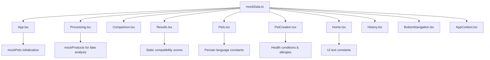
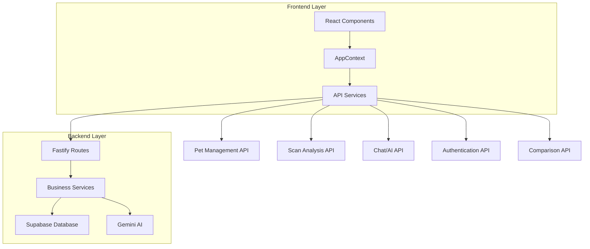

# Frontend Refactoring: App to Frontend Migration & Mock Data Removal

## Overview

This design document outlines the comprehensive refactoring plan for renaming the `/app` directory to `/frontend` and removing all mock data dependencies to connect the frontend application to the existing backend services. This transformation moves the application from a prototype with static data to a fully integrated full-stack solution.

## Current Architecture Analysis

### Current Structure
```
feedmagix-mlp/
├── app/                    # Frontend (Vite + React + TypeScript)
│   ├── src/
│   │   ├── components/     # UI components and screens
│   │   ├── contexts/       # React context providers
│   │   ├── data/          # Mock data files (TO BE REMOVED)
│   │   ├── types/         # TypeScript type definitions
│   │   └── ...
│   └── package.json       # Frontend dependencies
└── backend/               # Fastify + TypeScript backend
    ├── src/
    │   ├── routes/        # API endpoints
    │   ├── services/      # Business logic and AI services
    │   └── types/         # Backend type definitions
    └── package.json       # Backend dependencies
```

### Mock Data Dependencies

Current mock data usage analysis:



#### Mock Data Components
- **mockProducts**: 2 static food products with Persian names and nutritional data
- **mockPets**: 2 sample pets (Persian cat "میمی" and Golden Retriever "رکس")
- **healthConditions**: Array of 10 Persian health condition strings
- **allergies**: Array of 10 Persian allergy strings
- **countries**: Geographic data for Iran, Afghanistan, Turkey, Iraq
- **persian**: Comprehensive internationalization object with 50+ UI text strings

## Target Architecture

### New Structure
```
feedmagix-mlp/
├── frontend/              # Renamed from 'app'
│   ├── src/
│   │   ├── components/    # UI components and screens
│   │   ├── contexts/      # React context providers
│   │   ├── services/      # API client services (NEW)
│   │   ├── types/         # TypeScript type definitions
│   │   ├── utils/         # Utility functions (NEW)
│   │   └── constants/     # Static data (replaces mockData)
│   └── package.json       # Updated project name
└── backend/               # Unchanged
    └── ...
```

### API Integration Architecture



## Detailed Migration Plan

### 1. Directory Structure Changes

#### 1.1 Rename Root Directory
```bash
# Physical rename operation
mv /Users/ashtehrani/Desktop/feedmagix-mlp/app /Users/ashtehrani/Desktop/feedmagix-mlp/frontend
```

#### 1.2 Update Package Configuration
**File: `/frontend/package.json`**
- Update `name` field from "Pet Nutrition Assistant App" to "feedmagix-frontend"
- Add backend proxy configuration for development
- Update scripts to reference new directory structure

#### 1.3 Create New Service Layer
**New directory: `/frontend/src/services/`**
- `api.ts` - Base API client configuration
- `auth.ts` - Authentication service
- `pets.ts` - Pet management operations
- `scan.ts` - Scan and analysis operations
- `chat.ts` - Chat and AI interaction
- `comparison.ts` - Product comparison service

### 2. Mock Data Removal Strategy

#### 2.1 Static Data Migration
**From: `/frontend/src/data/mockData.ts`**
**To: `/frontend/src/constants/`**

| Current Mock Data | Migration Strategy | New Location |
|------------------|-------------------|--------------|
| `mockProducts` | Remove completely | Backend API |
| `mockPets` | Remove completely | Backend API |
| `healthConditions` | Move to constants | `/constants/healthData.ts` |
| `allergies` | Move to constants | `/constants/healthData.ts` |
| `countries` | Move to constants | `/constants/geographic.ts` |
| `persian` | Move to constants | `/constants/i18n.ts` |

#### 2.2 Component Updates

**AppContext.tsx Changes:**
```typescript
// REMOVE: Mock pet initialization
useEffect(() => {
  if (pets.length === 0) {
    mockPets.forEach(pet => addPet(pet));
  }
}, [pets.length, addPet]);

// REPLACE WITH: API-based pet loading
useEffect(() => {
  const loadUserPets = async () => {
    try {
      const userPets = await petService.getUserPets();
      setPets(userPets);
      if (userPets.length > 0 && !currentPet) {
        setCurrentPet(userPets[0]);
      }
    } catch (error) {
      console.error('Failed to load pets:', error);
    }
  };
  
  if (user) {
    loadUserPets();
  }
}, [user]);
```

**Processing.tsx Changes:**
```typescript
// REMOVE: Mock product assignment
setCurrentProduct(mockProducts[0]);

// REPLACE WITH: Real AI analysis
const analysisResult = await scanService.analyzeImage(scanImageUrl, currentPet.id);
setCurrentProduct(analysisResult.product);
setCurrentScanResult(analysisResult);
```

### 3. API Service Implementation

#### 3.1 Base API Configuration
**File: `/frontend/src/services/api.ts`**
```typescript
const API_BASE_URL = import.meta.env.VITE_API_URL || 'http://localhost:5000';

class APIClient {
  private baseURL: string;
  private token: string | null = null;

  constructor() {
    this.baseURL = API_BASE_URL;
  }

  setAuthToken(token: string) {
    this.token = token;
  }

  async request<T>(endpoint: string, options: RequestInit = {}): Promise<T> {
    const url = `${this.baseURL}${endpoint}`;
    const headers = {
      'Content-Type': 'application/json',
      ...(this.token && { Authorization: `Bearer ${this.token}` }),
      ...options.headers,
    };

    const response = await fetch(url, { ...options, headers });
    
    if (!response.ok) {
      throw new Error(`API request failed: ${response.statusText}`);
    }

    return response.json();
  }
}

export const apiClient = new APIClient();
```

#### 3.2 Pet Management Service
**File: `/frontend/src/services/pets.ts`**
```typescript
import { apiClient } from './api';
import { Pet } from '../types';

export const petService = {
  async getUserPets(): Promise<Pet[]> {
    return apiClient.request<Pet[]>('/api/pets');
  },

  async createPet(petData: Omit<Pet, 'id'>): Promise<Pet> {
    return apiClient.request<Pet>('/api/pets', {
      method: 'POST',
      body: JSON.stringify(petData),
    });
  },

  async updatePet(petId: string, petData: Partial<Pet>): Promise<Pet> {
    return apiClient.request<Pet>(`/api/pets/${petId}`, {
      method: 'PUT',
      body: JSON.stringify(petData),
    });
  },

  async deletePet(petId: string): Promise<void> {
    return apiClient.request<void>(`/api/pets/${petId}`, {
      method: 'DELETE',
    });
  }
};
```

#### 3.3 Scan Analysis Service
**File: `/frontend/src/services/scan.ts`**
```typescript
import { apiClient } from './api';
import { ScanResult, FoodProduct } from '../types';

export const scanService = {
  async uploadImage(imageFile: File): Promise<{ imageUrl: string }> {
    const formData = new FormData();
    formData.append('image', imageFile);

    return apiClient.request<{ imageUrl: string }>('/api/scan/upload', {
      method: 'POST',
      body: formData,
      headers: {}, // Remove Content-Type for FormData
    });
  },

  async analyzeImage(imageUrl: string, petId: string): Promise<{
    product: FoodProduct;
    analysis: ScanResult;
  }> {
    return apiClient.request('/api/scan/analyze', {
      method: 'POST',
      body: JSON.stringify({ imageUrl, petId }),
    });
  },

  async getScanHistory(): Promise<ScanResult[]> {
    return apiClient.request<ScanResult[]>('/api/scan/history');
  }
};
```

### 4. State Management Updates

#### 4.1 AppContext Refactoring
**File: `/frontend/src/contexts/AppContext.tsx`**

```typescript
// NEW: Loading states for async operations
interface AppContextType {
  // ... existing properties
  
  // Loading states
  isLoading: boolean;
  isLoadingPets: boolean;
  isLoadingScan: boolean;
  
  // Error handling
  error: string | null;
  setError: (error: string | null) => void;
  
  // Async operations
  loadUserPets: () => Promise<void>;
  createPet: (petData: Omit<Pet, 'id'>) => Promise<Pet>;
  performScan: (imageFile: File) => Promise<ScanResult>;
}
```

#### 4.2 Error Handling Strategy
```typescript
const handleApiError = (error: any, fallbackMessage: string) => {
  console.error('API Error:', error);
  const message = error.response?.data?.message || error.message || fallbackMessage;
  setError(message);
  
  // Auto-clear error after 5 seconds
  setTimeout(() => setError(null), 5000);
};
```

### 5. Environment Configuration

#### 5.1 Environment Variables
**File: `/frontend/.env`**
```env
VITE_API_URL=http://localhost:5000
VITE_SUPABASE_URL=your_supabase_url
VITE_SUPABASE_ANON_KEY=your_supabase_anon_key
```

**File: `/frontend/.env.production`**
```env
VITE_API_URL=https://api.feedmagix.com
VITE_SUPABASE_URL=your_production_supabase_url
VITE_SUPABASE_ANON_KEY=your_production_supabase_anon_key
```

### 6. Testing Strategy

#### 6.1 Component Testing Updates
- Remove mock data dependencies from component tests
- Add API mocking using MSW (Mock Service Worker)
- Test error states and loading states
- Validate API integration points

#### 6.2 Integration Testing
- Test complete user workflows with real backend
- Validate data flow from frontend to backend
- Test authentication integration
- Verify AI analysis pipeline

### 7. Development Workflow Updates

#### 7.1 Concurrent Development
```json
// New script in root package.json
{
  "scripts": {
    "dev": "concurrently \"cd backend && npm run dev\" \"cd frontend && npm run dev\"",
    "build": "cd backend && npm run build && cd ../frontend && npm run build",
    "start": "cd backend && npm start"
  }
}
```

#### 7.2 Proxy Configuration
**File: `/frontend/vite.config.ts`**
```typescript
export default defineConfig({
  plugins: [react()],
  server: {
    proxy: {
      '/api': {
        target: 'http://localhost:5000',
        changeOrigin: true,
        secure: false
      }
    }
  }
});
```

## Migration Impact Analysis

### Breaking Changes
1. **Component Props**: Components receiving mock data will need prop updates
2. **State Initialization**: Async loading replaces synchronous mock data
3. **Error Handling**: Components must handle API failures
4. **Loading States**: UI must accommodate asynchronous operations

### Backward Compatibility
- All existing TypeScript interfaces remain unchanged
- Component hierarchy and navigation flow preserved
- UI/UX experience maintained with real data

### Performance Considerations
- Initial load time may increase due to API calls
- Implement loading skeletons for better perceived performance
- Cache frequently accessed data in context
- Consider pagination for large datasets

## Risk Mitigation

### Data Migration Risks
- **Risk**: Loss of development data during transition
- **Mitigation**: Backup current state, implement seed data in backend

### API Integration Risks
- **Risk**: Frontend-backend type mismatches
- **Mitigation**: Share TypeScript types between frontend and backend

### User Experience Risks
- **Risk**: Slower app responsiveness
- **Mitigation**: Progressive loading, optimistic updates, proper error handling

## Validation Criteria

### Functional Requirements
✅ All mock data references removed  
✅ Frontend connects to backend APIs successfully  
✅ User can create, read, update, delete pets  
✅ Image scanning works with real AI analysis  
✅ Chat functionality integrates with Gemini AI  
✅ Authentication flow works end-to-end  
✅ Error handling provides meaningful feedback  
✅ Loading states improve user experience

### Technical Requirements
✅ No TypeScript compilation errors  
✅ All API endpoints return expected data structures  
✅ Environment configuration works across dev/prod  
✅ Build process succeeds for both frontend and backend  
✅ Tests pass with new API integration  
✅ Performance meets acceptable thresholds

### User Experience Requirements
✅ App functionality remains unchanged from user perspective  
✅ Loading times are acceptable (<3s for main operations)  
✅ Error messages are user-friendly and actionable  
✅ Persian language support maintained  
✅ Responsive design works across devices